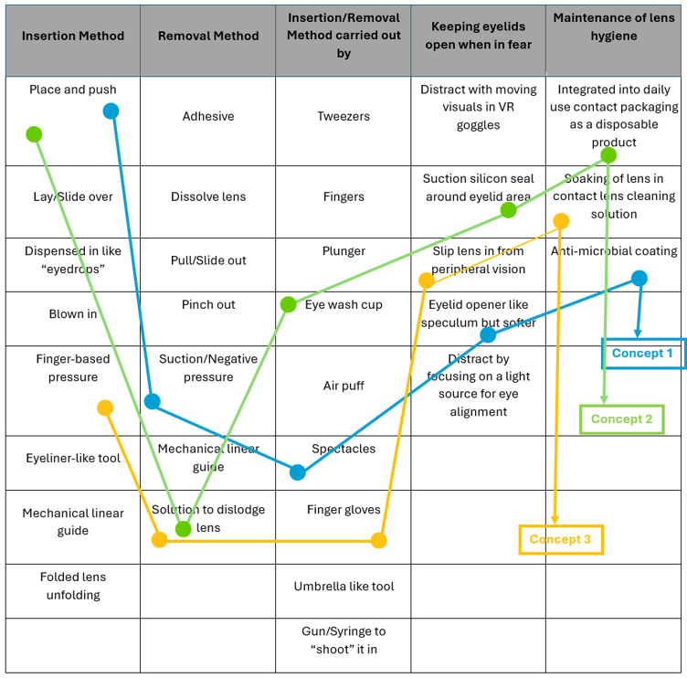

# Interim Report

## Acknowledgements
I would like to express my heartfelt gratitude to the Duke-NUS Health Innovator Programme (DHIP) for providing this invaluable opportunity to take on this project as part of CDE4301. My sincere thanks go to Dr. Foo Li Lian, my clinical mentor from Singapore National Eye Centre (SNEC), for her exceptional guidance in problem clarification, planning immersive clinical experiences, and offering insightful interviews and feedback that shaped the direction of this project. I am also deeply grateful to Ms Ashley Whitroff from Johnson & Johnson Vision Care, whose industry expertise and business insights significantly enriched my understanding of practical applications in the field of vision care.   

Additionally, I would like to extend my gratitude to DHIP Clinical Fellow Charles Yau and Business Fellow Melody Kwok for their invaluable assistance throughout this project in helping to bridge the gap for connection to clinical and industry partners in the ophthalmology and optometry field. Their advice and support greatly contributed to the development and progress of this work.   

Finally, I am deeply thankful to Professor Mark Chong for his invaluable guidance during the ideation, prototyping, and testing phases. His expertise and mentorship were instrumental in refining the concepts and bringing this project to life. The combined support from all these mentors and fellows has been critical to the success of this endeavor.

**List of Abbreviations**

|  Abbreviation   	|     Meaning    	|
|:---	|:---	|
|     SNEC    	|     Singapore National Eye Centre    	|
|     HPB    	|     Health Promotion Board    	|
|     MOH    	|     Ministry of Health    	|
|     n    	|     Number of Survey/Interview respondents    	|

## 1. Introduction and Background
Myopia, also known as Nearsightedness, is an eye condition caused by a refractive error that makes far-away objects look blurry. This condition occurs when the shape of the eye causes light to focus in front of the retina—a light-sensitive tissue layer at the back of the eye—instead of directly on it. Myopic patients often have trouble seeing faraway objects and may need to squint to bring them into focus ​[1]​. Eye strain, where the eyes feel tired or sore, is a frequent symptom, and some people may also experience headaches, though this is less common [1]. Myopia may progress into high myopia or severe nearsightedness (more than 6 diopters of myopia) [2], where patients may be at higher risk for severe ocular conditions such as cataract, glaucoma, retinal detachment, and myopic macular degeneration, all of which may lead to permanent vision loss [3]. To mitigate the severe complications associated with high myopia, early intervention is crucial to minimize the risk of myopia progression in children. 
### 1.1. Prevalence and Incidence of Myopia
Globally, there is higher myopia prevalence rates in school children in East Asia at 73%, compared to 42% in North America, while there was significantly lower prevalence of under 10% in African and South American children [3]. By 2050, 50% and 10% of the world will have myopia and high myopia, respectively [3]. In Singapore, the prevalence of myopia is among the highest in the world, with 65% of children being myopic by Primary 6, and 83% of young adults being myopic [4]. According to projection done by the Ministry of Health, 10% of children in Singapore will be myopic by 5 years old, 60% by 12 years old and 80% by 18 years old [5]. 

Myopia progression is fastest between ages 7 and 18, stabilizing as corneal curvature development completes. Thus, this project targets myopic children aged 7–18, as interventions beyond this age offer minimal benefits [6][7]. 
### 1.2 Existing Myopia Control Options

When a child presents themselves with rapidly progressing myopia (faster than –1.25 diopters/year) [8], treatment options for myopia progression control include prescription of Atropine eye drops, myopia control soft contact lenses, Ortho-keratology (Ortho-k) hard lenses, myopia control spectacles and combination therapy (Figure 1). 

Figure 1: Comparison of different myopia control methods

The efficacy of these myopia control methods is comparable to each other, are highly dependent on the individual’s preference and can have varying efficacies among different children (Appendix 7.1.) [10]. Hence, it is important that children are open to accepting the various treatment modalities that can best help control their myopia early. 

## 2. Problem Clarification
### 2.1. Data Collection
For this project, three key stakeholders, namely myopic children, parents, and clinicians – ophthalmologists and optometrists, have been identified. To better understand current practices and problems faced by our stakeholders, interviews with numerous myopic patients, ophthalmologists and optometrists were conducted (n=35). Surveys were also sent out to myopic patients across all age ranges across Asia (n=105) to better understand patient preferences towards the various myopia correction methods and what shaped their choices to opt for one modality over the other. (Interview and survey findings are in appendix 7.2.).

### 2.2. Existing Solutions

TABLE

Table 1: Comparison of existing solutions to remove and insert contact lenses based on myopic patients’ interview responses [13]

### 2.3. Stakeholder Needs

Based on interviews with stakeholders, key insights were extracted to better understand why most parents and children choose not to opt for myopia control contact lenses when presented with the option (Appendix 7.2). These insights then translated into need statements and used to inform the product’s design requirements as shown below in Table 2.

TABLE

Table 2: Evaluation of stakeholders’ needs and corresponding design requirements [13][14]

### 2.4. Problem Statement

Myopic children and their parents face significant challenges in adopting myopia control contact lenses due to concerns about the safety, hygiene, and ease of current lens insertion and removal methods. These concerns deter them from choosing this option, which may have greater efficacy in slowing myopia progression for their child. Consequently, intervention is often delayed, limiting access to effective myopia management and increasing the risk of the child’s vision progressing to high myopia at an early age, along with its associated severe ocular complications.

### 2.5. Need Statement

This project aims to improve the user-friendliness of contact lenses’ insertion and removal process to increase acceptance rates among myopic children aged 7 to 18 in Singapore from the current 20% acceptance rates (Appendix 7.2.3) to 30% (Appendix 7.2.1), thereby reducing the risk of high myopia and its associated complications.

## 3. Value Proposition

From the stakeholder needs, the value proposition statement has identified to be:
Our contact lens insertion and removal tool help myopic children aged 7-18 in Singapore who want to wear myopia control contact lenses by allowing them to do so safely and comfortably without depending on help from parents. 
Unlike existing contact lens insertion and removal methods such as usage of fingers, plunger or tweezer applicators, our tool allows children to insert and remove contact lenses independently in a user-friendly manner, without fear of hurting their eyeball surface.

## 4. Concept Generation and Design
### 4.1. Concept Generation
Based on the customers’ needs and design requirements of the product, Table 3 below shows the various concepts that were generated.

Table 3: Morphological chart for concept generation

### 4.2. Selected Concept

## 5. Initial Prototyping and Testing (and Challenges)
### 5.1. Testing of adherence of lens insertion
### 5.2. Testing of adherence of lens removal

## 6. Future Work

## 7. Appendix
### 7.1. Existing Myopia Correction Options
### 7.2. Key Survey Findings
### 7.3. Key Interview Findings - Optometrists and Opthalmologists
### 7.4. Key Interview Findings - Children and Parents, Myopic Patients

## 8. References

