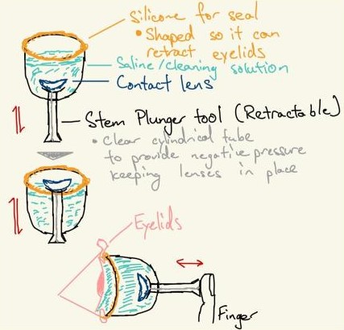
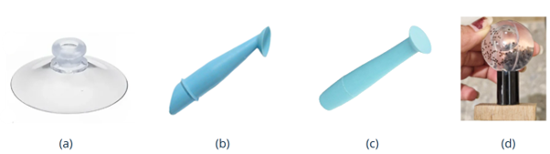
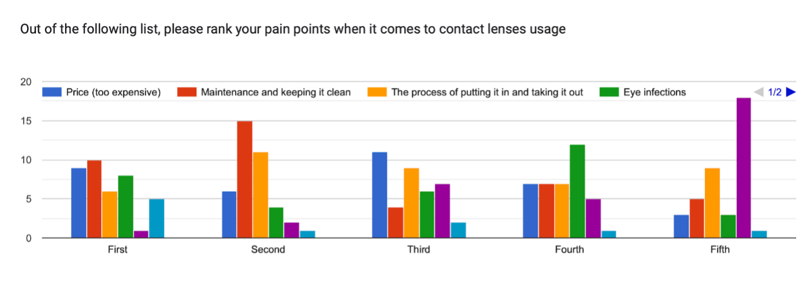

# EIM-456: Revolutionizing contact lenses handling for improved user experience (CDE4301 Interim Report)
**_Done By: Lakshmi Sujeesh (A0238379M)_**

## Acknowledgements
I would like to express my heartfelt gratitude to the Duke-NUS Health Innovator Programme (DHIP) for providing this invaluable opportunity to take on this project as part of CDE4301. My sincere thanks go to Dr. Foo Li Lian, my clinical mentor from Singapore National Eye Centre (SNEC), for her exceptional guidance in problem clarification, planning immersive clinical experiences, and offering insightful interviews and feedback that shaped the direction of this project. I am also deeply grateful to Ms Ashley Whitroff from Johnson & Johnson Vision Care, whose industry expertise and business insights significantly enriched my understanding of practical applications in the field of vision care.   

Additionally, I would like to extend my gratitude to DHIP Clinical Fellow Charles Yau and Business Fellow Melody Kwok for their invaluable assistance throughout this project in helping to bridge the gap for connection to clinical and industry partners in the ophthalmology and optometry field. Their advice and support greatly contributed to the development and progress of this work.   

Finally, I am deeply thankful to Professor Mark Chong for his invaluable guidance during the ideation, prototyping, and testing phases. His expertise and mentorship were instrumental in refining the concepts and bringing this project to life. The combined support from all these mentors and fellows has been critical to the success of this endeavor.

**List of Abbreviations**

|  Abbreviation   	|     Meaning    	|
|:---	|:---	|
|     SNEC    	|     Singapore National Eye Centre    	|
|     HPB    	|     Health Promotion Board    	|
|     MOH    	|     Ministry of Health    	|
|     n    	|     Number of Survey/Interview respondents    	|

## 1. Introduction and Background

Myopia, also known as Nearsightedness, is an eye condition caused by a refractive error that makes far-away objects look blurry. This condition occurs when the shape of the eye causes light to focus in front of the retina—a light-sensitive tissue layer at the back of the eye—instead of directly on it. Myopic patients often have trouble seeing faraway objects and may need to squint to bring them into focus ​[1]​. Eye strain, where the eyes feel tired or sore, is a frequent symptom, and some people may also experience headaches, though this is less common [1]. 

Myopia may progress into high myopia or severe nearsightedness (more than 6 diopters of myopia) [2], where patients may be at higher risk for severe ocular conditions such as cataract, glaucoma, retinal detachment, and myopic macular degeneration, all of which may lead to permanent vision loss [3]. To mitigate the severe complications associated with high myopia, early intervention is crucial to minimize the risk of myopia progression in children. 

### 1.1. Prevalence and Incidence of Myopia

Globally, there is higher myopia prevalence rates in school children in East Asia at 73%, compared to 42% in North America, while there was significantly lower prevalence of under 10% in African and South American children [3]. By 2050, 50% and 10% of the world will have myopia and high myopia, respectively [3]. In Singapore, the prevalence of myopia is among the highest in the world, with 65% of children being myopic by Primary 6, and 83% of young adults being myopic [4]. According to projection done by the Ministry of Health, 10% of children in Singapore will be myopic by 5 years old, 60% by 12 years old and 80% by 18 years old [5]. 

Myopia progression is fastest between ages 7 and 18, stabilizing as corneal curvature development completes. Thus, this project targets myopic children aged 7–18, as interventions beyond this age offer minimal benefits [6][7]. 

### 1.2 Existing Myopia Control Options

When a child presents themselves with rapidly progressing myopia (faster than –1.25 diopters/year) [8], treatment options for myopia progression control include prescription of Atropine eye drops, myopia control soft contact lenses, Ortho-keratology (Ortho-k) hard lenses, myopia control spectacles and combination therapy (Figure 1). 

<!--  -->

Figure 1: Comparison of different myopia control methods

The efficacy of these myopia control methods is comparable to each other, are highly dependent on the individual’s preference and can have varying efficacies among different children (Appendix 7.1.) [10]. Hence, it is important that children are open to accepting the various treatment modalities that can best help control their myopia early. 

## 2. Problem Clarification

### 2.1. Data Collection

For this project, three key stakeholders, namely myopic children, parents, and clinicians – ophthalmologists and optometrists, have been identified. To better understand current practices and problems faced by our stakeholders, interviews with numerous myopic patients, ophthalmologists and optometrists were conducted (n=35). Surveys were also sent out to myopic patients across all age ranges across Asia (n=105) to better understand patient preferences towards the various myopia correction methods and what shaped their choices to opt for one modality over the other. (Interview and survey findings are in appendix 7.2.).

### 2.2. Existing Solutions

<table class="tg"><thead>
  <tr>
    <th class="tg-0pky">Solution   </th>
    <th class="tg-0pky">    Benefits    </th>
    <th class="tg-0pky">    Disadvantages   </th>
  </tr></thead>
<tbody>
  <tr>
    <td class="tg-0pky">    Fingers  </td>
    <td class="tg-0pky">    · Most Used     · Easy control of placement angle     · Tactile   feedback on correct lens placement     · Easy to clean and maintain         </td>
    <td class="tg-0pky">    · Long time required to master technique for safe insertion and removal     · Inconvenient to do at any location     · Not able to secure lens properly     · Risk of infection if hands or fingernails are unclean     · Lens often sticks to fingers and does not come off easily during insertion   </td>
  </tr>
  <tr>
    <td class="tg-0pky">    Soft tip tweezer applicator     </td>
    <td class="tg-0pky">    · More hygienic than fingers since there is no direct hand contact with lens     · Improved grip compared to fingers for lens removal     · Easy to secure and dislodge lens when having dry eyes   </td>
    <td class="tg-0pky">    · Risks eye injury due to improper usage     · Long time required to master technique for safe insertion and removal     · Maintenance of sterility     · Appears frightening to use     · Not able to secure lens properly each time     · Lack of tactile feedback whether placement is accurate   </td>
  </tr>
  <tr>
    <td class="tg-0pky">    Contacts removal pincher (soft lens) / plunger (hard lens) tool</td>
    <td class="tg-0pky">· More hygienic than fingers since there is no direct hand contact with lens     · Improved grip compared to fingers for lens removal     · Easy to secure and dislodge lens when having dry eyes</td>
    <td class="tg-0pky">· Risks eye injury due to improper usage     · Long time required to master technique for safe insertion and removal     · Maintenance of sterility     · Appears frightening to use     · Not able to secure lens properly each time     · Lack of tactile feedback if placement is accurate</td>
  </tr>
</tbody></table>

Table 1: Comparison of existing solutions to remove and insert contact lenses based on myopic patients’ interview responses [13]

### 2.3. Stakeholder Needs

Based on interviews with stakeholders, key insights were extracted to better understand why most parents and children choose not to opt for myopia control contact lenses when presented with the option (Appendix 7.2.). These insights then translated into need statements and used to inform the product’s design requirements as shown below in Table 2.

<table style="border-collapse:collapse;border-spacing:0" class="tg"><thead>
<tr><th style="border-color:inherit;border-style:solid;border-width:1px;font-family:Arial, sans-serif;font-size:14px;font-weight:normal;overflow:hidden;padding:10px 5px;text-align:left;vertical-align:top;word-break:normal">Customer Statement&nbsp;&nbsp;&nbsp;</th><th style="border-color:inherit;border-style:solid;border-width:1px;font-family:Arial, sans-serif;font-size:14px;font-weight:normal;overflow:hidden;padding:10px 5px;text-align:left;vertical-align:top;word-break:normal">&nbsp;&nbsp;&nbsp; Needs Statement &nbsp;&nbsp;&nbsp;</th><th style="border-color:inherit;border-style:solid;border-width:1px;font-family:Arial, sans-serif;font-size:14px;font-weight:normal;overflow:hidden;padding:10px 5px;text-align:left;vertical-align:top;word-break:normal">&nbsp;&nbsp;&nbsp; Design Requirements&nbsp;&nbsp;&nbsp;</th>
<th style="border-color:inherit;border-style:solid;border-width:1px;font-family:Arial, sans-serif;font-size:14px;font-weight:normal;overflow:hidden;padding:10px 5px;text-align:left;vertical-align:top;word-break:normal">&nbsp;&nbsp;&nbsp; Metric&nbsp;&nbsp;&nbsp;</th></tr>
</thead>
<tbody>
<tr><td style="border-color:inherit;border-style:solid;border-width:1px;font-family:Arial, sans-serif;font-size:14px;overflow:hidden;padding:10px 5px;text-align:left;vertical-align:top;word-break:normal">&nbsp;&nbsp;&nbsp; “I can’t keep my eyelids open when I bring my fingers close to my eyes” &nbsp;&nbsp;&nbsp;   &nbsp;&nbsp;&nbsp; _Stakeholder:&nbsp;&nbsp;&nbsp;Patient – Myopic Child_&nbsp;&nbsp;&nbsp;</td><td style="border-color:inherit;border-style:solid;border-width:1px;font-family:Arial, sans-serif;font-size:14px;overflow:hidden;padding:10px 5px;text-align:left;vertical-align:top;word-break:normal">&nbsp;&nbsp;&nbsp; The product keeps the eyelids open during lens insertion and removal.&nbsp;&nbsp;&nbsp;</td>
<td style="border-color:inherit;border-style:solid;border-width:1px;font-family:Arial, sans-serif;font-size:14px;overflow:hidden;padding:10px 5px;text-align:left;vertical-align:top;word-break:normal">&nbsp;&nbsp;&nbsp; The product prevents eyelids from closing during insertion and removal process (need) &nbsp;&nbsp;&nbsp;  &nbsp;&nbsp;&nbsp;</td><td style="border-color:inherit;border-style:solid;border-width:1px;font-family:Arial, sans-serif;font-size:14px;overflow:hidden;padding:10px 5px;text-align:left;vertical-align:top;word-break:normal">&nbsp;&nbsp;&nbsp; Time taken that eyelids are kept open is same as duration of insertion &amp; removal process &nbsp;&nbsp;&nbsp;(Unit: *minutes*)&nbsp;&nbsp;&nbsp;</td></tr>
<tr><td style="border-color:inherit;border-style:solid;border-width:1px;font-family:Arial, sans-serif;font-size:14px;overflow:hidden;padding:10px 5px;text-align:left;vertical-align:top;word-break:normal">&nbsp;&nbsp;&nbsp; “It’s very uncomfortable to repeatedly push the plunger to touch my eyeball, takes me very long” &nbsp;&nbsp;&nbsp;   &nbsp;&nbsp;&nbsp; _Stakeholder:&nbsp;&nbsp;&nbsp;Patient – Myopic Child_&nbsp;&nbsp;&nbsp;</td><td style="border-color:inherit;border-style:solid;border-width:1px;font-family:Arial, sans-serif;font-size:14px;overflow:hidden;padding:10px 5px;text-align:left;vertical-align:top;word-break:normal">&nbsp;&nbsp;&nbsp; The product can remove and insert the lenses quickly&nbsp;&nbsp;&nbsp;</td>
<td style="border-color:inherit;border-style:solid;border-width:1px;font-family:Arial, sans-serif;font-size:14px;overflow:hidden;padding:10px 5px;text-align:left;vertical-align:top;word-break:normal">&nbsp;&nbsp;&nbsp; 1.        &nbsp;&nbsp;&nbsp;The product can help secure and remove contact lens from the cornea of the eye within 2 tries or less (Appendix 7.2.3.) &nbsp;&nbsp;&nbsp;  &nbsp;&nbsp;&nbsp;</td>
<td style="border-color:inherit;border-style:solid;border-width:1px;font-family:Arial, sans-serif;font-size:14px;overflow:hidden;padding:10px 5px;text-align:left;vertical-align:top;word-break:normal">&nbsp;&nbsp;&nbsp; 1.        &nbsp;&nbsp;&nbsp;Average number of attempts to insert contact lens in eye with tool  &nbsp;&nbsp;&nbsp;   &nbsp;&nbsp;&nbsp; (Range:&nbsp;&nbsp;&nbsp;≤ 2 *attempts*) &nbsp;&nbsp;&nbsp;  &nbsp;&nbsp;&nbsp;</td></tr>
<tr><td style="border-color:inherit;border-style:solid;border-width:1px;font-family:Arial, sans-serif;font-size:14px;overflow:hidden;padding:10px 5px;text-align:left;vertical-align:top;word-break:normal">&nbsp;&nbsp;&nbsp;  &nbsp;&nbsp;&nbsp;</td><td style="border-color:inherit;border-style:solid;border-width:1px;font-family:Arial, sans-serif;font-size:14px;overflow:hidden;padding:10px 5px;text-align:left;vertical-align:top;word-break:normal">&nbsp;&nbsp;&nbsp;  &nbsp;&nbsp;&nbsp;</td><td style="border-color:inherit;border-style:solid;border-width:1px;font-family:Arial, sans-serif;font-size:14px;overflow:hidden;padding:10px 5px;text-align:left;vertical-align:top;word-break:normal">&nbsp;&nbsp;&nbsp; 2.        &nbsp;&nbsp;&nbsp;The product exerts a force on the contact lens that can overcome the force of the eye on the lens. &nbsp;&nbsp;&nbsp;  &nbsp;&nbsp;&nbsp;</td>
<td style="border-color:inherit;border-style:solid;border-width:1px;font-family:Arial, sans-serif;font-size:14px;overflow:hidden;padding:10px 5px;text-align:left;vertical-align:top;word-break:normal">&nbsp;&nbsp;&nbsp; 2.        &nbsp;&nbsp;&nbsp;Force of tool on cornea during lens removal &gt; surface tension forces around the contact lens periphery pulling the lens toward the cornea [15] &nbsp;&nbsp;&nbsp;   &nbsp;&nbsp;&nbsp; (Range: &gt; 0.27 *Newtons*) [16]&nbsp;&nbsp;&nbsp;</td></tr>
<tr><td style="border-color:inherit;border-style:solid;border-width:1px;font-family:Arial, sans-serif;font-size:14px;overflow:hidden;padding:10px 5px;text-align:left;vertical-align:top;word-break:normal">&nbsp;&nbsp;&nbsp;  &nbsp;&nbsp;&nbsp;</td><td style="border-color:inherit;border-style:solid;border-width:1px;font-family:Arial, sans-serif;font-size:14px;overflow:hidden;padding:10px 5px;text-align:left;vertical-align:top;word-break:normal">&nbsp;&nbsp;&nbsp;  &nbsp;&nbsp;&nbsp;</td><td style="border-color:inherit;border-style:solid;border-width:1px;font-family:Arial, sans-serif;font-size:14px;overflow:hidden;padding:10px 5px;text-align:left;vertical-align:top;word-break:normal">&nbsp;&nbsp;&nbsp; 3.        &nbsp;&nbsp;&nbsp;The time taken by the product to insert and remove lenses ≤ 10 minutes (Appendix 7.2.3)&nbsp;&nbsp;&nbsp;</td>
<td style="border-color:inherit;border-style:solid;border-width:1px;font-family:Arial, sans-serif;font-size:14px;overflow:hidden;padding:10px 5px;text-align:left;vertical-align:top;word-break:normal">&nbsp;&nbsp;&nbsp; 3.        &nbsp;&nbsp;&nbsp;Average time taken to insert and remove contact lens in eye with tool &nbsp;&nbsp;&nbsp;   &nbsp;&nbsp;&nbsp; (Range:≤  10 *minutes*)&nbsp;&nbsp;&nbsp;</td></tr>
<tr><td style="border-color:inherit;border-style:solid;border-width:1px;font-family:Arial, sans-serif;font-size:14px;overflow:hidden;padding:10px 5px;text-align:left;vertical-align:top;word-break:normal">&nbsp;&nbsp;&nbsp; “I can’t take out the lenses if my hands are dirty, I always need to make sure my hands are clean and wash them before I wear my lenses” &nbsp;&nbsp;&nbsp;   &nbsp;&nbsp;&nbsp; _Stakeholder: Patient – Myopic Child_&nbsp;&nbsp;&nbsp;</td><td style="border-color:inherit;border-style:solid;border-width:1px;font-family:Arial, sans-serif;font-size:14px;overflow:hidden;padding:10px 5px;text-align:left;vertical-align:top;word-break:normal">&nbsp;&nbsp;&nbsp; The product maintains sterility of lenses.&nbsp;&nbsp;&nbsp;</td>
<td style="border-color:inherit;border-style:solid;border-width:1px;font-family:Arial, sans-serif;font-size:14px;overflow:hidden;padding:10px 5px;text-align:left;vertical-align:top;word-break:normal">&nbsp;&nbsp;&nbsp; The product should ensure that contact&nbsp;&nbsp;&nbsp;lenses is as hygienic during insertion compared to its sterility right after&nbsp;&nbsp;&nbsp;cleaning. (Appendix 7.2.3) &nbsp;&nbsp;&nbsp;  &nbsp;&nbsp;&nbsp;</td><td style="border-color:inherit;border-style:solid;border-width:1px;font-family:Arial, sans-serif;font-size:14px;overflow:hidden;padding:10px 5px;text-align:left;vertical-align:top;word-break:normal">&nbsp;&nbsp;&nbsp; No. of colony-forming units (CFUs) on lenses after using the tool  &nbsp;&nbsp;&nbsp;   &nbsp;&nbsp;&nbsp; (Range: ≤ baseline *CFUs* before tool was used)&nbsp;&nbsp;&nbsp;</td></tr>
<tr><td style="border-color:inherit;border-style:solid;border-width:1px;font-family:Arial, sans-serif;font-size:14px;overflow:hidden;padding:10px 5px;text-align:left;vertical-align:top;word-break:normal">&nbsp;&nbsp;&nbsp; “It's so scary what if it scratches my eye” &nbsp;&nbsp;&nbsp;   &nbsp;&nbsp;&nbsp; _Stakeholder:&nbsp;&nbsp;&nbsp;Patient – Myopic Child_&nbsp;&nbsp;&nbsp;</td><td style="border-color:inherit;border-style:solid;border-width:1px;font-family:Arial, sans-serif;font-size:14px;overflow:hidden;padding:10px 5px;text-align:left;vertical-align:top;word-break:normal">&nbsp;&nbsp;&nbsp; 1.        &nbsp;&nbsp;&nbsp;The product does not cause injury from putting in or removing contact lenses&nbsp;&nbsp;&nbsp;</td>
<td style="border-color:inherit;border-style:solid;border-width:1px;font-family:Arial, sans-serif;font-size:14px;overflow:hidden;padding:10px 5px;text-align:left;vertical-align:top;word-break:normal">&nbsp;&nbsp;&nbsp; 1.        &nbsp;&nbsp;&nbsp;The product does not cause abrasions on corneal surface (need)&nbsp;&nbsp;&nbsp;</td><td style="border-color:inherit;border-style:solid;border-width:1px;font-family:Arial, sans-serif;font-size:14px;overflow:hidden;padding:10px 5px;text-align:left;vertical-align:top;word-break:normal">&nbsp;&nbsp;&nbsp; 1.        &nbsp;&nbsp;&nbsp;Number of abrasions on cornea same as before use of tool (= initial *no. of abrasions*)&nbsp;&nbsp;&nbsp;</td></tr>
<tr><td style="border-color:inherit;border-style:solid;border-width:1px;font-family:Arial, sans-serif;font-size:14px;overflow:hidden;padding:10px 5px;text-align:left;vertical-align:top;word-break:normal">&nbsp;&nbsp;&nbsp;  &nbsp;&nbsp;&nbsp;</td><td style="border-color:inherit;border-style:solid;border-width:1px;font-family:Arial, sans-serif;font-size:14px;overflow:hidden;padding:10px 5px;text-align:left;vertical-align:top;word-break:normal">&nbsp;&nbsp;&nbsp; 2.        &nbsp;&nbsp;&nbsp;The product reduces fear of injury from wearing lenses among children.&nbsp;&nbsp;&nbsp;&nbsp;</td>
<td style="border-color:inherit;border-style:solid;border-width:1px;font-family:Arial, sans-serif;font-size:14px;overflow:hidden;padding:10px 5px;text-align:left;vertical-align:top;word-break:normal">&nbsp;&nbsp;&nbsp; 2.        &nbsp;&nbsp;&nbsp;The product visually does not invoke a fear of injury.&nbsp;&nbsp;&nbsp;</td><td style="border-color:inherit;border-style:solid;border-width:1px;font-family:Arial, sans-serif;font-size:14px;overflow:hidden;padding:10px 5px;text-align:left;vertical-align:top;word-break:normal">&nbsp;&nbsp;&nbsp; 2. Tool has a higher rating on Visual Analogue Scale (VAS) (1-10) regarding perceived pain compared to using competitor products [17]  &nbsp;&nbsp;&nbsp;   &nbsp;&nbsp;&nbsp; (Range:&nbsp;&nbsp;&nbsp;&gt;7)&nbsp;&nbsp;&nbsp;</td></tr>
<tr><td style="border-color:inherit;border-style:solid;border-width:1px;font-family:Arial, sans-serif;font-size:14px;overflow:hidden;padding:10px 5px;text-align:left;vertical-align:top;word-break:normal">&nbsp;&nbsp;&nbsp; “I can’t keep helping my child to put on the lens every time, I am too busy for that and can’t accompany my child to school” &nbsp;&nbsp;&nbsp;   &nbsp;&nbsp;&nbsp; _Stakeholder: Parent/Caretaker_&nbsp;&nbsp;&nbsp;</td><td style="border-color:inherit;border-style:solid;border-width:1px;font-family:Arial, sans-serif;font-size:14px;overflow:hidden;padding:10px 5px;text-align:left;vertical-align:top;word-break:normal">&nbsp;&nbsp;&nbsp; The product simple enough for the child to use on their own.&nbsp;&nbsp;&nbsp;</td>
<td style="border-color:inherit;border-style:solid;border-width:1px;font-family:Arial, sans-serif;font-size:14px;overflow:hidden;padding:10px 5px;text-align:left;vertical-align:top;word-break:normal">&nbsp;&nbsp;&nbsp; The product allows independent usage by&nbsp;&nbsp;&nbsp;the child. &nbsp;&nbsp;&nbsp;  &nbsp;&nbsp;&nbsp;</td><td style="border-color:inherit;border-style:solid;border-width:1px;font-family:Arial, sans-serif;font-size:14px;overflow:hidden;padding:10px 5px;text-align:left;vertical-align:top;word-break:normal">&nbsp;&nbsp;&nbsp; Time taken by child to use tool on his/her own &nbsp;&nbsp;&nbsp;(Unit: *minutes*)&nbsp;&nbsp;&nbsp;</td></tr>
<tr><td style="border-color:inherit;border-style:solid;border-width:1px;font-family:Arial, sans-serif;font-size:14px;overflow:hidden;padding:10px 5px;text-align:left;vertical-align:top;word-break:normal">&nbsp;&nbsp;&nbsp; “The session to teach them how to wear the lens takes way too&nbsp;&nbsp;&nbsp;long, I can use this time to clear more patients” &nbsp;&nbsp;&nbsp;   &nbsp;&nbsp;&nbsp; _Stakeholder: Clinician - Optometrist_&nbsp;&nbsp;&nbsp;</td><td style="border-color:inherit;border-style:solid;border-width:1px;font-family:Arial, sans-serif;font-size:14px;overflow:hidden;padding:10px 5px;text-align:left;vertical-align:top;word-break:normal">&nbsp;&nbsp;&nbsp; The product allows contact lens wearers to put on contact lenses&nbsp;&nbsp;&nbsp;quickly.&nbsp;&nbsp;&nbsp;</td>
<td style="border-color:inherit;border-style:solid;border-width:1px;font-family:Arial, sans-serif;font-size:14px;overflow:hidden;padding:10px 5px;text-align:left;vertical-align:top;word-break:normal">&nbsp;&nbsp;&nbsp; The product&nbsp;&nbsp;&nbsp;reduces chair-time for contact lens wearers from the current 1.5 hours to&nbsp;&nbsp;&nbsp;under 10 minutes.&nbsp;&nbsp;&nbsp;</td><td style="border-color:inherit;border-style:solid;border-width:1px;font-family:Arial, sans-serif;font-size:14px;overflow:hidden;padding:10px 5px;text-align:left;vertical-align:top;word-break:normal">&nbsp;&nbsp;&nbsp; Average time&nbsp;&nbsp;&nbsp;taken to insert and remove contact lens in eye with tool &nbsp;&nbsp;&nbsp;   &nbsp;&nbsp;&nbsp; (Range: ≤ 10&nbsp;&nbsp;&nbsp;*minutes*)</td></tr>
</tbody></table>

Table 2: Evaluation of stakeholders’ needs and corresponding design requirements [13][14]

### 2.4. Problem Statement

Myopic children and their parents face significant challenges in adopting myopia control contact lenses due to concerns about the safety, hygiene, and ease of current lens insertion and removal methods. These concerns deter them from choosing this option, which may have greater efficacy in slowing myopia progression for their child. Consequently, intervention is often delayed, limiting access to effective myopia management and increasing the risk of the child’s vision progressing to high myopia at an early age, along with its associated severe ocular complications.

### 2.5. Need Statement

This project aims to improve the user-friendliness of contact lenses’ insertion and removal process to increase acceptance rates among myopic children aged 7 to 18 in Singapore from the current 20% acceptance rates (Appendix 7.2.3.) to 30% (Appendix 7.2.1), thereby reducing the risk of high myopia and its associated complications.

## 3. Value Proposition

From the stakeholder needs, the value proposition statement has identified to be:

Our contact lens insertion and removal tool help myopic children aged 7-18 in Singapore who want to wear myopia control contact lenses by allowing them to do so safely and comfortably without depending on help from parents. 

Unlike existing contact lens insertion and removal methods such as usage of fingers, plunger or tweezer applicators, our tool allows children to insert and remove contact lenses independently in a user-friendly manner, without fear of hurting their eyeball surface.

## 4. Concept Generation and Design
### 4.1. Concept Generation

Based on the customers’ needs and design requirements of the product, Table 3 was used to generate various ideas and Figures 2 to 4 below shows the shortlisted concepts that were generated from Table 3 after discussion and iteration with Dr Foo. 

 

Table 3: Morphological chart for concept generation

 

Figure 2: Concept 1 (Eyewash cup) sketch

 

Figure 3: Concept 2 (Flip out spectacles) sketch

 

Figure 4: Concept 3 (Finger glove suction) sketch

 

### 4.2. Selected Concept

Weights were assigned for the 3 main pain points identified by stakeholders based on the importance that they ranked these pain points in the survey. 

For the tool safety perception category, the flip out spectacles was ranked the highest as the concept of using spectacles is already very familiar and comfortable to children, making them more likely to perceive it as a safe option for lens insertion. 

Looking at the lens hygiene aspect of the tool, the eyewash cup was ranked the lowest as it requires transferring from the lens packaging to the plunger using fingers, while the flip out spectacles comes directly out of the packaging and hence does not require any external lens contact by the user. 

The eyewash cup and flip out spectacles are equally convenient to use, given that they can be carried around and stored in a safe and clean manner, without the need to find a mirror to check lens alignment on cornea. For the finger glove suction, it is slightly less convenient to use as the user might require a mirror to check positioning and alignment before insertion and removal of lens. 
Given these ratings for the selection criteria, concept 2, the flip out spectacles have been deemed to be the selected concept as it significantly outweighed the other concepts.

  

<table class="tg" style="undefined;table-layout: fixed; width: 925px"><colgroup>
<col style="width: 177.2px">
<col style="width: 57.2px">
<col style="width: 105.2px">
<col style="width: 115.2px">
<col style="width: 100.2px">
<col style="width: 145.2px">
<col style="width: 102.2px">
<col style="width: 122.2px">
</colgroup>
<thead>
  <tr>
    <th class="tg-kftd" colspan="2">    </th>
    <th class="tg-7fle" colspan="2">Concept 1: Eyewash cup</th>
    <th class="tg-7fle" colspan="2">Concept 2: Flip out spectacles</th>
    <th class="tg-7fle" colspan="2">Concept 3: Finger glove suction</th>
  </tr></thead>
<tbody>
  <tr>
    <td class="tg-7ryv">Selection criteria</td>
    <td class="tg-7ryv">Weight</td>
    <td class="tg-calz">Rating (1 - 5)</td>
    <td class="tg-calz">Weighted score</td>
    <td class="tg-calz">Rating (1 - 5)</td>
    <td class="tg-calz">Weighted score</td>
    <td class="tg-calz">Rating (1 - 5)</td>
    <td class="tg-calz">Weighted score</td>
  </tr>
  <tr>
    <td class="tg-m9r4">Tool Safety Perception</td>
    <td class="tg-baqh">0.5</td>
    <td class="tg-baqh">4</td>
    <td class="tg-baqh">2.0</td>
    <td class="tg-baqh">5</td>
    <td class="tg-baqh">2.5</td>
    <td class="tg-baqh">4</td>
    <td class="tg-baqh">2.0</td>
  </tr>
  <tr>
    <td class="tg-m9r4">Lens Hygiene</td>
    <td class="tg-baqh">0.3</td>
    <td class="tg-baqh">3</td>
    <td class="tg-baqh">0.9</td>
    <td class="tg-baqh">5</td>
    <td class="tg-baqh">1.5</td>
    <td class="tg-baqh">4</td>
    <td class="tg-baqh">1.2</td>
  </tr>
  <tr>
    <td class="tg-m9r4">Convenience of tool usage</td>
    <td class="tg-baqh">0.2</td>
    <td class="tg-baqh">4</td>
    <td class="tg-baqh">0.8</td>
    <td class="tg-baqh">4</td>
    <td class="tg-baqh">0.8</td>
    <td class="tg-baqh">3</td>
    <td class="tg-baqh">0.6</td>
  </tr>
  <tr>
    <td class="tg-m9r4">Total Score (out of 5)</td>
    <td class="tg-baqh">1.0</td>
    <td class="tg-baqh">-</td>
    <td class="tg-baqh">3.7</td>
    <td class="tg-baqh">-</td>
    <td class="tg-baqh">4.8</td>
    <td class="tg-baqh">-</td>
    <td class="tg-baqh">3.8</td>
  </tr>
  <tr>
    <td class="tg-m9r4">Rank</td>
    <td class="tg-baqh"> </td>
    <td class="tg-baqh" colspan="2">2</td>
    <td class="tg-baqh" colspan="2">1</td>
    <td class="tg-baqh" colspan="2">3</td>
  </tr>
</tbody></table>

Table 4: Concept selection table

  

This product concept – Flip out spectacles - consists of certain features and their functions as well as how they address our customers’ needs will be explained in detail in the table below (Table 4).

  

<table class="tg"><thead>
  <tr>
    <th class="tg-b3sw">Product Feature</th>
    <th class="tg-b3sw">Function</th>
    <th class="tg-b3sw">How it meets customers’ needs</th>
  </tr></thead>
<tbody>
  <tr>
    <td class="tg-0lax">Suction plunger</td>
    <td class="tg-0lax">1.        Secure the lens in place for insertion and removal with negative pressure 2.        Provides outward suction force to overcome force exerted by tear film and surface tension forces around the contact lens periphery during removal 3.        Provides inward force for adherence of lens from plunger onto tear film during insertion</td>
    <td class="tg-0lax">It helps to ensure that the lens can be placed on the cornea surface quickly without multiple attempts.</td>
  </tr>
  <tr>
    <td class="tg-0lax">Magnetic control of plunger movement</td>
    <td class="tg-0lax">Ensures that plunger movement is controlled and repeatable</td>
    <td class="tg-0lax">User will not have to spend a long time learning the right technique as the motion is controlled by the magnets.</td>
  </tr>
  <tr>
    <td class="tg-0lax">Peel off film with disposable lens pre-packaged inside</td>
    <td class="tg-0lax">Eliminates need for handling lens using hand</td>
    <td class="tg-0lax">This poses minimal risk of infections while ensuring hygiene standards are met without children or parents having to take responsibility to manually clean lens regularly.</td>
  </tr>
  <tr>
    <td class="tg-0lax">Eyelid opener</td>
    <td class="tg-0lax">Keep eyelids open during insertion and removal process</td>
    <td class="tg-0lax">It prevents child from blinking due to reflex when plunger approaches eyeball for a quick insertion, without relying on help from parents to keep eyes open.</td>
  </tr>
  <tr>
    <td class="tg-0lax">Child-friendly Spectacle design</td>
    <td class="tg-0lax">Reduces anticipation of injury, provides stability to reduce risk of eye injuries from unintentional hand movement.</td>
    <td class="tg-0lax">Child may be more willing to try out product and be less frightened as it looks like spectacles that they are already familiar and comfortable with. It also provides a stable means to help facilitate the insertion and removal process for children to reduce risk of injury.</td>
  </tr>
</tbody></table>

Table 5: Breakdown of product concept

## 5. Initial Prototyping, Testing and Challenges

As of the date of submission of this report, the prototyping and testing has been focused towards refining the specifications of the suction plunger feature design within concept 2 to be able to properly secure the lens for insertion and removal.  Soft lenses from J&J Acuvue have been used in all testing conducted by far.
Three types of work-like suction plungers were used as preliminary model to mimic the force and shape of the suction plunger design as shown below in Figures 5a and 5b. DMV plunger made of rubber latex and suction cup made of Polyvinyl Chloride (PVC) were used as prototypes for testing on a spherical plastic surface that was intended to mimic the corneal surface, with a diameter of 28mm, similar to that of the human eye [18] (Figure 5c).  To better simulate the moisture of human eye's tear film layer, 3 drops of saline solution was applied to the spherical surface during testing.

 

Figure 5: (a) Suction cup made of PVC, (b) 45 Angled DMV plunger made of rubber latex, (c) Spherical surface used to mimic corneal surface

 

### 5.1. Testing of adherence of lens insertion – Automatic force application

Testing of lens adherence on the corneal surface was done using a Vertical Automatic Handy Test stand, where the PVC Suction cup with soft lens attached was set to shift down till it reaches compression point on the sphere, following which it would shift up to measure the tensional force at a constant rate of 2 mm/minute. The set-up is as shown in Figure 6 below.

The purpose of this test was to determine the minimal force required by the suction cup at the point where the lens adheres onto the mimicked corneal surface. This is to set a baseline value that the prototype plunger should meet when it is designed. This value can be identified using the peak noticed in the graph as shown in the aspirational plot shown below (Figure 7), obtained due to the upward force of the spherical surface on the force sensor due to the compression experienced upon contact. 

During testing, the expected force stabilization graph was not obtained; instead, the force values continued to increase without reaching a peak. This behaviour can likely be attributed to the surface compliance of the silicone hydrogel material used in the soft contact lens and the silicone suction cup. These materials may have deformed under compression, leading to continuous resistance and preventing a stable maximum force measurement from being achieved [19][20].

Moreover, the recorded forces were unexpectedly high, reaching values around 90 N, which significantly exceeds the typical forces experienced by the eyeball during aggressive actions such as rubbing eyes with knuckles (less than 20 N) [21]. This discrepancy might be due to excessive compression of the lenses caused by the preset movement rate of 2 mm/min in the testing setup. Such high forces are unsuitable for real-world lens insertion on the eyeball due to safety concerns.

To address this issue, a refined testing method is required to apply an appropriate force to the spherical “eye” surface while avoiding excessive compression of the lenses. This adjustment would better simulate realistic conditions and ensure that the forces remain within safe and clinically relevant ranges.

 

Figure 6: Experiment set-up using automatic test stand and standard size PVC suction cup before (left) and after (right) suction cup touches spherical surface

  

Figure 7: Expected graph plot for experiment (Aspirational plot)

 

### 5.2. Testing of adherence of lens insertion – Manual force application

Given the inconclusive results from the Automatic Handy Test stand, the testing setup was modified to use a manual force gauge mounted on a test stand (Figure 8). This alternative manual method allowed for better control over compression, as the downward motion of the force sensor was stopped immediately upon observing full contact between the lens and the “eye” surface, before it was lifted back up so that the suction cup no longer has any contact on the lens surface, and the contact lens have been detached from the suction cup. 

A video recording was made to document the process, and the highest force value observed during the manual lowering of the sensor was recorded. This peak force represented the moment of contact between the lens and the surface, offering a clearer indication of the force required for adherence. This process was repeated thrice to ensure repeatability of results and the average peak force was calculated (Table 6). 

This entire experiment was repeated with the 45-degree and 90-degree DMV Plunger (Figure 9). The purpose of this was to check if contact angle of the lens on the surface made an impact on the peak force needed to place the lens. The values are recorded in Table 6, and as shown, the peak force required by the 45-degree DMV plunger was lesser than that of the 90 degree one, indicating that a 45-degree angle would be preferred for lens insertion such that there will be minimal force exerted on the corneal surface. This finding aligns with insights from the literature, which explains that at a 45-degree angle, forces are distributed through a rolling motion, whereas at 90 degrees, a more direct compressive force is applied. The rolling motion at 45 degrees allows for better alignment of the lens and a more uniform spread of the tear film, reducing resistance due to capillary effects [23]. 

Therefore, moving forward, different materials of the plunger at a 45 degree insertion angle can be tested out to determine the most suitable material to provide minimal insertion peak force.

 

<table class="tg"><thead>
  <tr>
    <th class="tg-0lax"> </th>
    <th class="tg-kftd">Trial 1</th>
    <th class="tg-kftd">Trial 2</th>
    <th class="tg-kftd">Trial 3</th>
    <th class="tg-b3sw">Average (to 2 d.p.)</th>
    <th class="tg-b3sw">Standard deviation</th>
  </tr></thead>
<tbody>
  <tr>
    <td class="tg-kftd">45 Degree DMV Plunger</td>
    <td class="tg-baqh">0.02</td>
    <td class="tg-baqh">0.05</td>
    <td class="tg-baqh">0.04</td>
    <td class="tg-amwm">0.04</td>
    <td class="tg-amwm">0.02</td>
  </tr>
  <tr>
    <td class="tg-kftd">90 Degree DMV Plunger</td>
    <td class="tg-baqh">0.09</td>
    <td class="tg-baqh">0.10</td>
    <td class="tg-baqh">0.08</td>
    <td class="tg-amwm">0.09</td>
    <td class="tg-amwm">0.01</td>
  </tr>
  <tr>
    <td class="tg-kftd">PVC Suction cup</td>
    <td class="tg-baqh">1.52</td>
    <td class="tg-baqh">1.34</td>
    <td class="tg-baqh">1.48</td>
    <td class="tg-amwm">1.45</td>
    <td class="tg-amwm">0.09</td>
  </tr>
</tbody>
</table>

Table 6: Average values of force measurements (in Newtons).

 

  

 

Figure 8: Force sensor experimental set-up using PVC suction cup, with saline solution added to stimulate tear film on corneal surface

  

Figure 9: Force sensor experimental set-up using 45 Degree DMV plunger, showing reading upon contact of plunger containing lenses upon contact with surface.

 

### 5.3. Testing of adherence of lens removal

The experiment conducted in 5.2. was repeated, except the purpose of the experiment was to now detach the contact lens on the “eyeball” surface by shifting up the force sensor manually. However, both angled DMV plungers as well as the silicon suction cup failed to adhere onto the surface of the contact lens strong enough to lift it off the eyeball surface, and hence no force values could be recorded. This indicates that the upward suction force exerted by the plunger materials (silicon and latex rubber) was insufficient to overcome the surface tension forces around the contact lens periphery pulling the lens toward the cornea. 

Thus, moving forward, further testing needs to be conducted after using different type of plunger materials and sizes to see which one is the most suitable in being able to provide sufficient upward lifting force.

## 6. Future Work

To build upon the progress made so far, a projected timeline for the next phases of work is illustrated in Figure 8. The current stage focuses on preliminary engineering, which involves constructing individual components and procuring materials for testing. Subsequent steps will include conducting experiments on the other elements of the selected concept, integrating these parts into a cohesive prototype, and initiating testing and quality checks between late February and March. This schedule ensures sufficient time for iterative modifications and detailed documentation before the final deliverables are prepared in April and May.

Component testing will be conducted in a laboratory setting to address biohazard risks associated with using porcine eyeballs as part of the evaluations. Additionally, testing the complete concept in a clinical environment will be vital to gather on-the-ground feedback from healthcare professionals. This input will be critical for refining and improving the prototype to meet practical healthcare needs.

Figure 8: Gantt chart for future work

## 7. Appendix
### 7.1. Existing Myopia Correction Options

 

Figure 9: Competitive landscape representation of various myopia progression control methods

### 7.2.1 Key Survey Findings

 

Figure 10: Most preferred myopia correction method

  

Figure 11: List of Myopia correction methods used 

  

Figure 12: Contact lens usage pain points 

  

Figure 13: Contact lens users pain points

  

### 7.2.2 Key Interview Findings - Optometrists and Opthalmologists

 

Figure 14: Representation of clinical flow in selection of contact lenses option for myopia control based on interview findings (Source: Dr Foo Li Lian, private optometrists)

### 7.2.3. Key Interview Findings - Children and Parents, Myopic Patients

  

Figure 15: Representation of patient flow in selection of contact lenses option for myopia control using Leaky Bucket Model (Source: Dr Foo Li Lian, SNEC, HPB, private optometrists)

  

<table class="tg"><thead>
  <tr>
    <th class="tg-c3ow">Pain point category</th>
    <th class="tg-c3ow">Interview Insights and Literature review findings</th>
  </tr></thead>
<tbody>
  <tr>
    <td class="tg-0pky">Discomfort &amp; Safety concerns from lens usage</td>
    <td class="tg-0pky">·        Patients that did use contacts experienced dry eyes and worried about injury on removal  ·        ranked highest (10 on a scale of 1-10) on survey  ·        Existing products on the market that help remove and insert contact lenses were ranked &lt;7 (on a Likert scale of 1-10) regarding their likeliness of the product being safe enough for use  ·        Fear of eye injury and discomfort from improper lens insertion/removal technique [22]  ·        Often takes multiple attempts to remove and place lens in the correct position (at least 4-5 tries) for first time wearers  ·        Can take up to 2 hours to learn how to wear lenses for the first time (most patients take about 1-1.5 hours to learn how to wear the lens)</td>
  </tr>
  <tr>
    <td class="tg-0pky">Maintaining lens hygiene</td>
    <td class="tg-0pky">·        Fear of potential eye infections that may arise due to improper lens hygiene, especially for monthly wear  ·        Most opt for daily wear contact lens options to minimise risk of infection  ·        Process of maintaining sterile lenses and ensuring cleanliness is frustrating even after many years</td>
  </tr>
  <tr>
    <td class="tg-0pky">Lack of convenience of lens wearing</td>
    <td class="tg-0pky">·        Parents prioritise their children being able to put on and remove lenses without always having to rely on parents to do it for them  ·        Parents lack the time to spend early in the morning every day to help their child put on their lenses and often find it a chore, opting to not go for contact lenses when presented with the option  ·        Children often lack the skill and correct technique to open their eyelids with their own fingers, so the parents have to help them open their eyelids and insert the lenses  ·        Parents who are contact lens wearers are more likely to be open to accepting contact lenses as a myopia progression control option for their child</td>
  </tr>
</tbody></table>

Table 7: Top 3 pain points regarding usage of contact lenses from myopic patient interviews

 

## 8. References
[1] ‘Nearsightedness (Myopia) | National Eye Institute’. Available: https://www.nei.nih.gov/learn-about-eye-health/eye-conditions-and-diseases/nearsightedness-myopia. [Accessed: Nov. 15, 2024]

[2] ‘Nearsightedness: What Is Myopia?’, American Academy of Ophthalmology, Nov. 07, 2024. Available: https://www.aao.org/eye-health/diseases/myopia-nearsightedness. [Accessed: Nov. 15, 2024]

[3] B. A. Holden et al., ‘Global Prevalence of Myopia and High Myopia and Temporal Trends from 2000 through 2050’, Ophthalmology, vol. 123, no. 5p, pp. 1036–1042, May 2016, doi: http://dx.doi.org/10.1016/j.ophtha.2016.01.006. Available: https://www.aaojournal.org/article/S0161-6420(16)00025-7/fulltext

[4] Ministry of Health, ‘Speech By Dr Lam Pin Min, Senior Minister of State for Health, At the Opening for Singapore National Eye Centre’, Speech By Dr Lam Pin Min, Senior Minister of State for Health, At the Opening for Singapore National Eye Centre, Aug. 16, 2019. Available: https://www.moh.gov.sg/newsroom/speech-by-dr-lam-pin-min-senior-minister-of-state-for-health-at-the-opening-of-the-singapore-national-eye-centre-s-myopia-centre-16-august-2019. [Accessed: Nov. 15, 2024]

[5] ‘Myopia’. Available: https://www.snec.com.sg:443/research-innovation/research-groups-platforms/research-groups/myopia. [Accessed: Nov. 15, 2024]

[6] D. Tricard, S. Marillet, P. Ingrand, M. A. Bullimore, R. R. A. Bourne, and N. Leveziel, ‘Progression of myopia in children and teenagers: a nationwide longitudinal study’, British Journal of Ophthalmology, vol. 106, no. 8, pp. 1104–1109, Aug. 2022, doi: 10.1136/bjophthalmol-2020-318256. Available: https://bjo.bmj.com/content/106/8/1104. [Accessed: Nov. 16, 2024]

[7] M. A. Bullimore et al., ‘IMI—Onset and Progression of Myopia in Young Adults’, Investigative Ophthalmology & Visual Science, vol. 64, no. 6, p. 2, May 2023, doi: 10.1167/iovs.64.6.2. Available: https://pmc.ncbi.nlm.nih.gov/articles/PMC10153577/. [Accessed: Nov. 16, 2024]

[8] S. Matsumura et al., ‘Annual Myopia Progression and Subsequent 2-Year Myopia Progression in Singaporean Children’, Translational Vision Science & Technology, vol. 9, no. 13, p. 12, Dec. 2020, doi: 10.1167/tvst.9.13.12. Available: https://pmc.ncbi.nlm.nih.gov/articles/PMC7726587/. [Accessed: Nov. 16, 2024]

[9] J. Bao et al., ‘One-year myopia control efficacy of spectacle lenses with aspherical lenslets’, British Journal of Ophthalmology, vol. 106, no. 8, pp. 1171–1176, Aug. 2022, doi: 10.1136/bjophthalmol-2020-318367. Available: https://bjo.bmj.com/content/106/8/1171. [Accessed: Nov. 16, 2024]

[10] C. Lanca, C. P. Pang, and A. Grzybowski, ‘Effectiveness of myopia control interventions: A systematic review of 12 randomized control trials published between 2019 and 2021’, Frontiers in Public Health, vol. 11, p. 1125000, Mar. 2023, doi: 10.3389/fpubh.2023.1125000. Available: https://pmc.ncbi.nlm.nih.gov/articles/PMC10076805/. [Accessed: Nov. 16, 2024]

[11] H. Lv, Z. Liu, J. Li, Y. Wang, Y. Tseng, and X. Li, ‘Long-Term Efficacy of Orthokeratology to Control Myopia Progression’, Eye & Contact Lens, vol. 49, no. 9, p. 399, Jul. 2023, doi: 10.1097/ICL.0000000000001017. Available: https://pmc.ncbi.nlm.nih.gov/articles/PMC10442101/. [Accessed: Nov. 16, 2024]

[12] H.-R. Tsai, J.-H. Wang, H.-K. Huang, T.-L. Chen, P.-W. Chen, and C.-J. Chiu, ‘Efficacy of atropine, orthokeratology, and combined atropine with orthokeratology for childhood myopia: A systematic review and network meta-analysis’, Journal of the Formosan Medical Association, vol. 121, no. 12, pp. 2490–2500, Dec. 2022, doi: 10.1016/j.jfma.2022.05.005. Available: https://www.sciencedirect.com/science/article/pii/S0929664622002108. [Accessed: Nov. 16, 2024]

[13] V. Chen, K. Halim, J. Yung, D. Yap, D. Lo, and J. Leong, ‘Interviews with myopic patients’, Aug. 08, 2024. Available: https://docs.google.com/spreadsheets/d/1OWrjkkcqs339WvKRt8eUxgZZM-8rob_jT5-HqUBz6F8/edit?usp=sharing

[14] L. L. Foo and Jia Ling, ‘Interview with optometrists and opthalmologists’, Aug. 08, 2024.

[15] T. T. Hayashi, Fatt, and Irving, ‘Forces Retaining a Contact Lens on the Eye between Blinks.’, American Academy of Optometry, vol. Optometry and Vision Science, pp. 485–507, Aug. 1980.

[16] M.-C. Hsiao, Y.-C. Yen, C.-H. Wang, Y.-N. Chen, S.-P. Wang, and K.-C. Su, ‘Biomechanical evaluation of different plunger size and plunger position on removing soft contact lenses and rigid gas permeable contact lenses’, Technology and Health Care, vol. 32, no. 6, pp. 4109–4121, Jan. 2024, doi: 10.3233/THC-231983. Available: https://content.iospress.com/articles/technology-and-health-care/thc231983. [Accessed: Nov. 16, 2024]

[17] R. Du Toit, N. Pritchard, S. Heffernan, T. Simpson, and D. Fonn, ‘A Comparison of Three Different Scales for Rating Contact Lens Handling’:, Optometry and Vision Science, vol. 79, no. 5, pp. 313–320, May 2002, doi: 10.1097/00006324-200205000-00011. Available: http://journals.lww.com/00006324-200205000-00011. [Accessed: Nov. 16, 2024]

[18] I. Bekerman, P. Gottlieb, and M. Vaiman, ‘Variations in Eyeball Diameters of the Healthy Adults’, Journal of Ophthalmology, vol. 2014, p. 503645, Nov. 2014, doi: 10.1155/2014/503645. Available: https://pmc.ncbi.nlm.nih.gov/articles/PMC4238270/. [Accessed: Nov. 17, 2024]

[19] C. S. A. Musgrave and F. Fang, ‘Contact Lens Materials: A Materials Science Perspective’, Materials, vol. 12, no. 2, p. 261, Jan. 2019, doi: 10.3390/ma12020261. Available: https://www.mdpi.com/1996-1944/12/2/261. [Accessed: Nov. 18, 2024]

[20] ‘Explanation of contact lens properties and features | Johnson and Johnson Vision Care’. Available: https://www.jnjvisioncare.ae/education/quick-learning-by-topic/balance-of-properties/explanation-of-contact-lens-properties-and-features. [Accessed: Nov. 18, 2024]

[21] F. Hafezi et al., ‘Assessment of the mechanical forces applied during eye rubbing’, BMC Ophthalmology, vol. 20, p. 301, Jul. 2020, doi: 10.1186/s12886-020-01551-5. Available: https://pmc.ncbi.nlm.nih.gov/articles/PMC7374951/. [Accessed: Nov. 18, 2024]

[22] R. Weng, T. Naduvilath, K. Philip, X. Chen, and P. Sankaridurg, ‘Exploring non-adherence to contact lens wear schedule: Subjective assessments and patient related factors in children wearing single vision and myopia control contact lenses’, Contact Lens and Anterior Eye, vol. 44, no. 1, pp. 94–101, Feb. 2021, doi: 10.1016/j.clae.2020.11.015. Available: https://linkinghub.elsevier.com/retrieve/pii/S1367048420302083. [Accessed: Nov. 18, 2024]

[23] D. Zhu, Y. Liu, and J. L. Gilbert, ‘Micromechanical measurement of adhesion of dehydrating silicone hydrogel contact lenses to corneal tissue’, Acta Biomaterialia, vol. 127, pp. 242–251, Jun. 2021, doi: 10.1016/j.actbio.2021.03.053. Available: https://www.sciencedirect.com/science/article/pii/S1742706121002038. [Accessed: Nov. 18, 2024]
